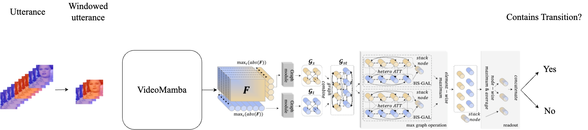
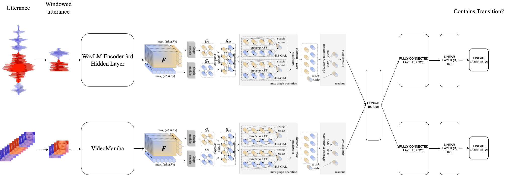

# AV-DeepFake-Detection

## Introduction
This repository contains the code for the paper "Utilizing Transitions to Locate Partially Manipulated Segments in Multimodal Audio-Visual Data" and the accompanying Master's Thesis "Leveraging Transitions for Detecting Fake Segments in Partially Manipulated Audio-Video Data: A Case Study using the AV-Deepfake 1M Corpus". 

## Model figures

### Audio-only

### Visual-only

### Early fusion Multimodal

### Late fusion Multimodal

## Installation
